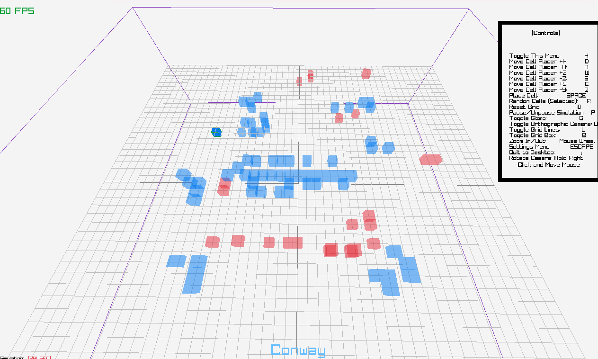
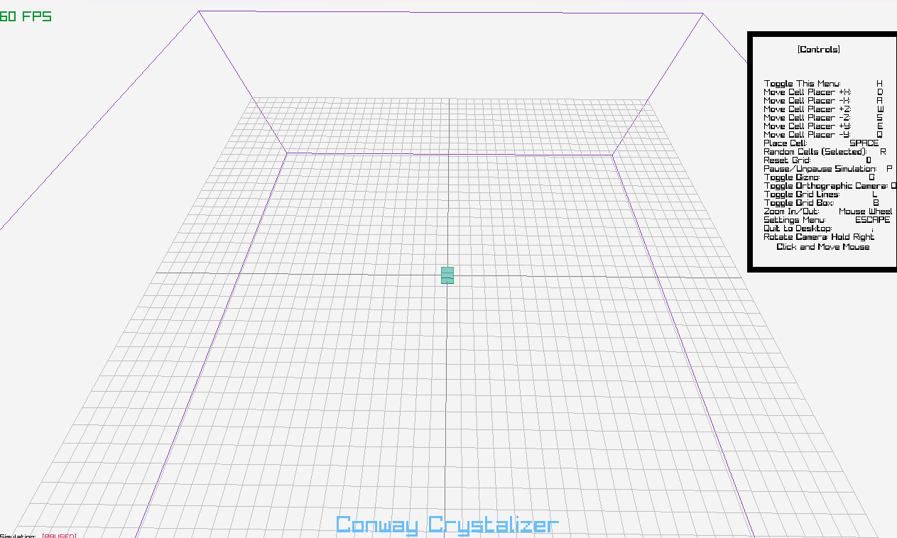
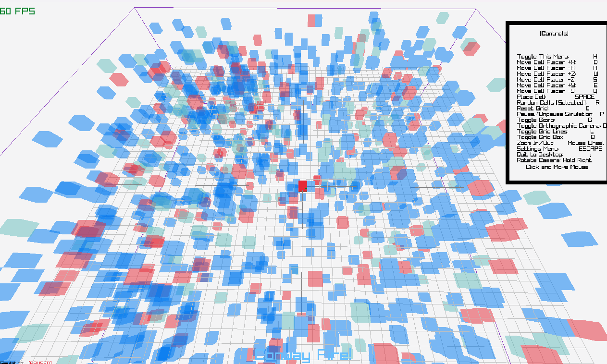

# LDJAM56
Game for Lundum Dare 56!
[Jame Page](https://ldjam.com/events/ludum-dare/56/cellular-automota)
Cellular Automota in 3D (or 2.5D your choice)! Conway’s Game of Life, Langton’s Ant and and a few other things! Tiny Creatures was the theme maybe we can call ants and CA tiny creatures. Recommend native binary linked below for performance






# Running

## Web Version
You can run the game at the [Jame Page](https://ldjam.com/events/ludum-dare/56/cellular-automota)
You can download and unzip it, though it seems to need a http server, you can run
```python
python -m http.server
```
in the unzipped directory then navigate too `localhost:8000`
## Binary
Reccomend the binary for performance reasons, simply download the zip for the appropriate platform (Windows or Linux) unzip and run

# Building binary from Source
Source code on the main branch does contain post jam improvements, the binary's in the releases are the versions released during the submission hour of the jam or before.

```
git clone https://github.com/TheFloatingBrain/LDJAM56.git
```

## Windows
### Visual Studio CE 2022

If you have the Visual C++ and CMake tools simply open the LDJAM56 folder with visual studio and "Build All" after cmake generation has finished.

### CMake
```
cd LDJAM56
mkdir build
cd build
cmake .. -G "Visual Studio 17 2022"
```
Then either open "ALL_BUILD" with visual studio

## GNU/Linux
```
cd LDJAM56
mkdir build
cd build
cmake ..
make
# OR make -j $(nproc)
```
